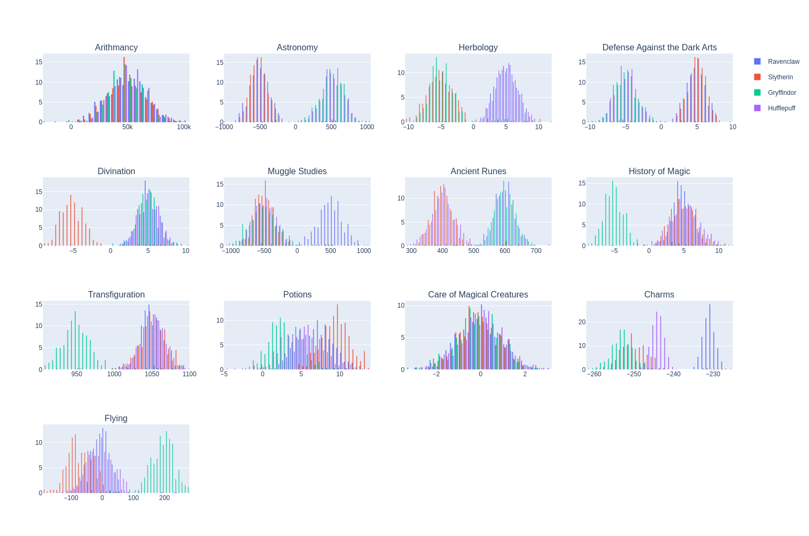

# Hogwarts Sorting Hat - Machine Learning with Logistic Regression

Welcome to the Hogwarts Sorting Hat project! This project aims to recreate the magical Sorting Hat using modern data science tools. We will utilize logistic regression, a fundamental classification algorithm in machine learning, to sort new students into their respective houses: Gryffindor, Hufflepuff, Ravenclaw, or Slytherin.




## Project Objectives

- **Data Exploration**: Learn to read, visualize, and clean a dataset.
- **Feature Engineering**: Select and preprocess relevant features from the data.
- **Model Training**: Train a logistic regression model to solve the classification problem.
- **Model Evaluation**: Evaluate the performance of the model and make improvements.

## Installation

1. Clone the repository:
    ```sh
    git clone https://github.com/tgrasset/dslr.git
    ```
2. Change to the project directory:
    ```sh
    cd dslr
    ```
3. Install the required libraries:
    ```sh
    pip install pandas numpy matplotlib seaborn
    ```

## Usage
Optional : Use our `describe.py` script to get information about the dataset such as `mean`, `std`, `min`, `max`, etc, about the different features. Then you can also visualize data using our `histogram.py`, `scatter_plot.py` and `pair_plot` scripts.
1. Train the model:
    ```sh
    python3 logreg_train.py datasets/dataset_train.csv
    ```
2. Make predictions:
    ```sh
    python3 logreg_train.py datasets/dataset_test.csv
    ```
3. Compare predictions with true values:
    ```sh
    diff houses.csv datasets/dataset_truth.csv
    ```
    This should show you only 4 lines where our program got the wrong output, out of 400 lines, which makes our sorting hat 99% accurate. Good enough for Mrs McGonagall according to the subject =)

## Acknowledgements

This project was made with my teammate acostes at 42 school.

